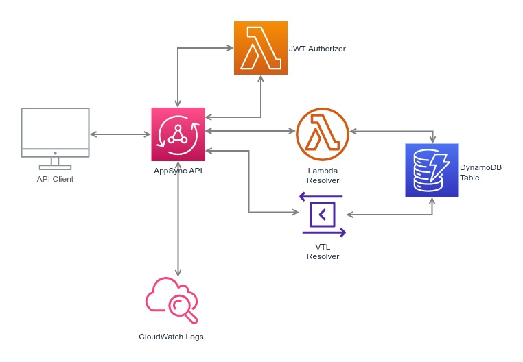

# cdk-appsync-boiler

A CDK AppSync example API



## API

A GraphQL API provide by AWS AppSync. The [API types](lib/graphql/API.ts), [queries](lib/graphql/queries.ts) & [mutatations](lib/graphql/mutations.ts) are defined under `lib/graphql/`. These files are not required, but are a useful representation of the current API. Run `make codegen` whenever changes have been made to schema.graphql to automatically update the reference files mentioned above.

### GQL Schema
The [GraphQL schema](lib/schema.graphql) defines the data models & connections.

### GQL Resolvers
Several example [VTL resolvers](lib/resolvers) are provided, which use DynamoDB as a data source. An example [Lambda Function resolver](src/handlers/device-get-resolver.ts) that also uses DynamoDB as a data soure is provide as well. 

### Access Logs
Access logs are automatically sent to a CloudWatch logs group named `/aws/appsync/apis/{ApiId}` 

## DynamoDB
Each record is uniquely identified with `pk` & `sk` keys (partition & sort keys). In this case a `Device` is a parent entity to one or more `Sensor` entities.

* A given device can be located by retrieving the only record that has both a pk & sk equal to `DEVICE#1234`
* All sensors belonging to device `1234` can be found by querying for records that have a pk = `DEVICE#1234` and an sk beginning with `SENSOR#`

### Entity Schema
| entity  | pk  | sk |
| ------------- | ------------- | ------------- |
| Device  | DEVICE#1234 | DEVICE#1234 |
| Sensor | DEVICE#1234 | SENSOR#3333 |
| Sensor | DEVICE#1234 | SENSOR#4444 |

## Authentication
The API is secured by a [Custom Lambda Authorizer](https://aws.amazon.com/blogs/mobile/appsync-lambda-auth/). The client must provide a valid JWT in the `Authorization` header. The authorizor only confirms that the JWT has been signed with the correct key, but additional claims could also be inspected/validated in the future.

### Key Pairs
A private key is required when creating JWTs, the associated public key is required when validating a given JWT. New key pairs can be generated by runninng `make jwt-keys`.

The private & public keys are stored under secret `app/jwt/privateKey` & `app/jwt/publicKey` respectively, and must be populated manually (only once) after initial stack deploy.

### Obtain a JWT
Lambda `GenerateJwt` can be run manually from within the AWS web console and will return a JWT token in the Execution Results Response. This is for testing/development only, ultimately this lambda would be replaced with an complete authentication service.

Helper [scripts](scripts/) are also provided to assist in creating & validating JWTs locally.

## Local Testing

### API Requests
File [gql.http](./gql.http) can be used to send API requests from your local machine. The requests defined are createe by simply copied and pasted from lib/graphql/queries.ts & lib/graphql/mutations.ts with a small signature edit.

First define a `.env` file with the variables shown below & install the [VSCode REST Client extension](https://marketplace.visualstudio.com/items?itemName=humao.rest-client).

```bash
API_URL=https://3g6k6nj43ravfbrisbk3tjtc7q.appsync-api.us-east-1.amazonaws.com/graphql
TOKEN=your-jwt-token-here
```

## Related Documentation

### AppSync
* [https://docs.aws.amazon.com/appsync/latest/devguide/appsync-dg.pdf](https://docs.aws.amazon.com/appsync/latest/devguide/appsync-dg.pdf)
* [https://aws.amazon.com/blogs/mobile/appsync-lambda-auth/](https://aws.amazon.com/blogs/mobile/appsync-lambda-auth/)

### Relay
* [https://relay.dev/docs/guides/graphql-server-specification/](https://relay.dev/docs/guides/graphql-server-specification/)

## Development

### Makefile
A Makefile is provided in the project root directory and is used to run helper commands during local development.

Default environment variables used by the Makefile can be overwritten by creating a `Makefile.env` file as shown below. This file is **OPTIONAL** and should **NOT** be committed into version control.

```bash
AWS_PROFILE=default
LAMBDA_NAME=GenerateJwt
LAMBDA_EVENT=events/event.json
TEST_NAME=mytest
...
```

**Usage Examples**
```bash
make test
```

| Command     | Description                                  |
| ----------- | -------------------------------------------- |
| help        | Describe all available commands              |
| npmi        | Install npm dependencies                     |
| test        | Run unit tests and code coverage report      |
| test-single | Run a single unit test/suite                 |
| coverage    | Run unit tests & coverage report             |
| unit        | Run unit tests                               |
| clean       | Delete local artifacts                       |
| local-init  | Generate initial local dev support files     |
| deploy      | Deploy CDK app using local build             |
| invoke      | Invoke individual Lambda                     |
| invoke-out  | Invoke individual Lambda & pipe logs to file |
| codegen     | Generate GraphQL code/types                  |


### Code Linting

ESLint is used for static code analysis. It is configured to use `Google's TypeScript style guide` (gts).
Run `make lint` to view a project level static code analysis.

### Local Lambda Execution

Lambda functions can be run locally during testing & development by running `make invoke` or `make invoke-out`

#### Requirements
* AWS SAM CLI
* Docker
* Make (installed by default in OSX)

#### Process
1. Run `make local-init` (only once)
2. Choose the lambda to run by setting LAMBDA_NAME in `Makefile.env`
3. Choose the event that will be sent to the lambda setting LAMBDA_EVENT in `Makefile.env`
4. Run `make invoke-out`
5. View resulting lambda execution logs in `invoke.out`

#### [Sample Lambda Events Here](docs/lambda-events.md)